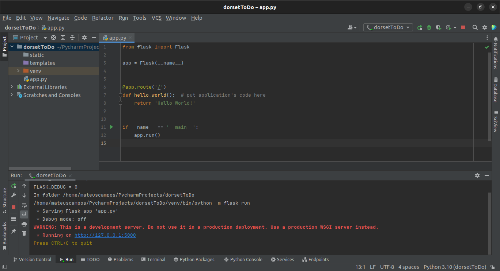
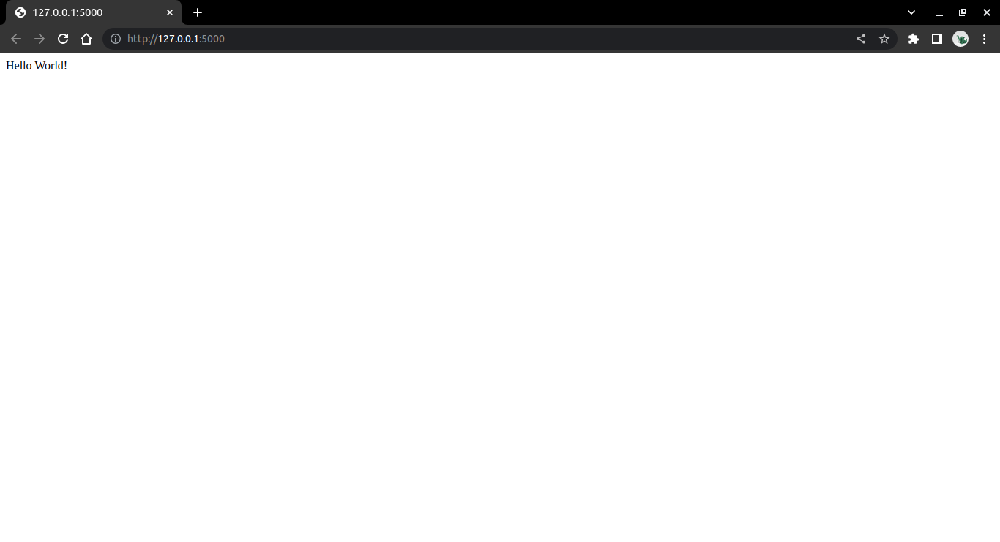
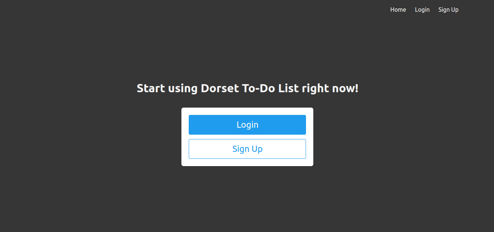
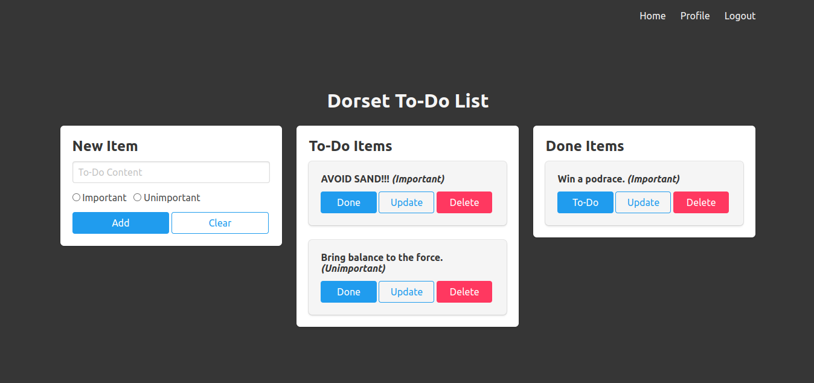
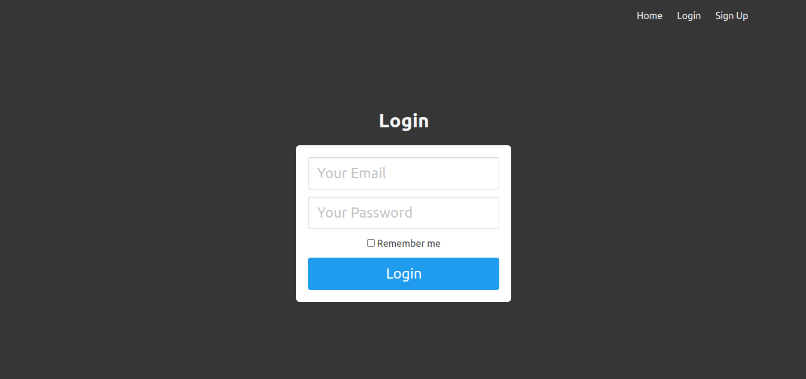
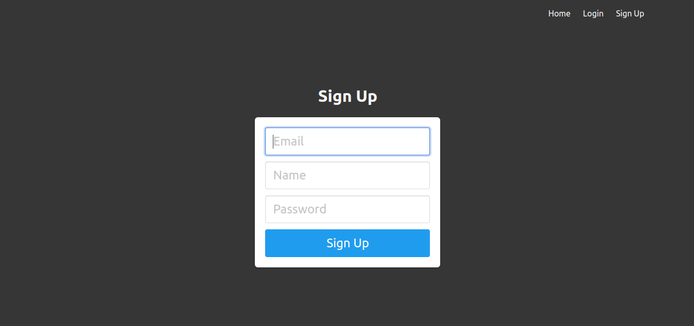
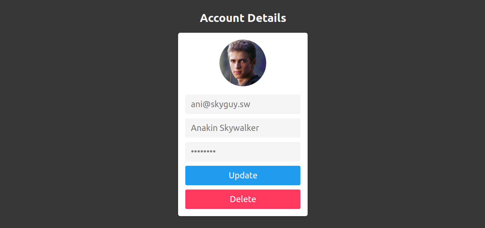
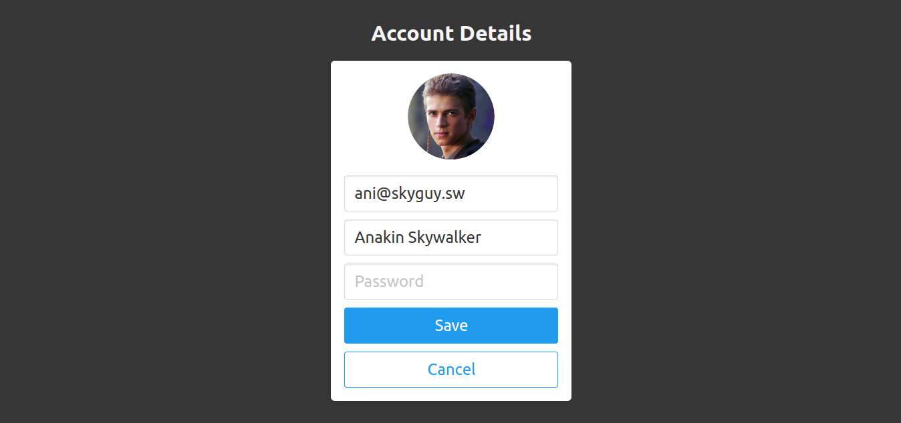

# Flask Web App: To-Do List

**Dorset College Dublin**  
**BSc in Science in Computing & Multimedia**  
**Back-End Web Development - BSC30922**  
**Year 3, Semester 2**  
**Continuous Assessment 4**

**Lecturer name:** Geoff Wright  
**Lecturer email:** geoff.wright@dorset.ie

**Student Name:** Mateus Fonseca Campos  
**Student Number:** 24088  
**Student Email:** 24088@student.dorset-college.ie

**Submission date:** 18 April 2023

This repository contains a "To-Do List" Flask web app developed for my CA 4 at Dorset College BSc in Computing, Year 3, Semester 2.

## Part 1: Requirements and Setup

**Framework:** this project requires installation of both **[Python](https://www.python.org/downloads/)** and **[Flask](https://flask.palletsprojects.com/en/2.2.x/installation/)**.

**Packages:** to install all the packages required by this application, as well as their dependencies, type the following on a terminal window at the root of the project:

    pip install -r requirements.txt

**Database engine:** the project also requires access to a database through a user with enough privileges to create new tables and manipulate the data therein. The application is configured to work with the **[MongoDB Atlas](https://www.mongodb.com/docs/atlas/getting-started/)** cloud database.

**Environment:** create a file called *.env* at the root of the project with the following content:

    SECRET_KEY='<replace with your project's secrete key>'
    MONGODB_URI='<replace with your MongoDB Atlas cluster's connection string>'

## Part 2: Background

Similarly to Django, Flask relies on the MVT (Model-View-Template) design pattern to achieve *separation of concerns*, a key aspect of modular programming. Each component of the MVT pattern has distinct responsibilities:

- **Model:** Flask models are Python classes that can be instantiated as runtime representations of database entities. The class' properties map to the entity's attributes.

- **View:** views are Python functions/classes written to respond to web requests. They map to specific URL endpoints and are set to handle requests according to the implemented logic inside.

- **Template:** through Jinja, the framework makes it possible to write HTML files containing variables as placeholders that can be dynamically rendered as part of a web response. It also allows for the implementation of control flow statements to handle data pertaining presentation.

Another important design aspect of Flask are **Blueprints**, which allow applications to grow in a modular way and keep the code DRY. A Blueprint is an app-like code that does not get instantiated on its own, rather it serves as a mold for creating extensions to the base app. Read more about Blueprints [here](https://flask.palletsprojects.com/en/2.2.x/blueprints/).

## Part 3: Breakdown

This project was developed based on the web framework Flask and its MVT design pattern. It implements a simple *to-do list* that allows the user to add and delete to-dos, as well as mark them as done and bring them back if needed. The following scheme explains the organization of its main components:

- **1. Models**  

      /
      └── models.py

  - **1.1. User**  
  This class represents the User entity in the database. Its attributes are:
    - **id:** auto-generated ObjectId value created by MongoDB.
    - **email:** the user's email.
    - **name:** the user's name.
    - **password:** the user's password, salted and hashed.

- **2. Views**  

      /
      ├── auth.py
      └── main.py

  - **2.1 auth.login**  
  This method controls user requests to the associated blueprint defined in the URL pattern *.../login*. It renders the template *login.html* and accepts:
    - **GET:** if the user is authenticated, redirects to home page, else, renders login page.
    - **POST:** if the user is authenticated, redirects to home page, else, verifies that the provided credentials are valid and login the user in.
  
    **Restrictions:** this view has no restrictions.
  - **2.2 auth.signup**  
  This method controls user requests to the associated blueprint defined in the URL pattern *.../signup*. It renders the template *signup.html* and accepts:
    - **GET:** if the user is authenticated, redirects to home page, else, renders signup page.
    - **POST:** if the user is authenticated, redirects to home page, else, verifies that the provided details are valid and email is not already in use. If positive, creates new user and redirects to login page.
  
    **Restrictions:** this view has no restrictions.
  - **2.3 auth.logout**    
  This method controls user requests to the associated blueprint defined in the URL pattern *.../logout*. It accepts:
    - **GET:** logs user out and redirects to home page.
  
    **Restrictions:** user must be logged in.
  - **2.4 auth.update**    
  This method controls user requests to the associated blueprint defined in the URL pattern *.../user/<user_id>/update/*. It accepts:
    - **POST:** if email is being updated, verifies that it is not already in use by other user. If positive, updates user details and redirects to profile page.
  
    **Restrictions:** user must be logged in.
  - **2.5 auth.delete**   
  This method controls user requests to the associated blueprint defined in the URL pattern *.../user/<user_id>/delete/*. It accepts:
    - **POST:** deletes user from database and logs out local instance.
  
    **Restrictions:** user must be logged in.
  - **2.6 main.index**   
  This method controls user requests to the associated blueprint defined in the URL pattern *.../*. It renders the template *index.html* and accepts:
    - **GET:** if the user is authenticated, displays list of to-dos, else, offers options to either log in or sign up.
    - **POST:** if the user is authenticated, creates new to-do, else, redirects to login page.
  
    **Restrictions:** this view has no restrictions.
  - **2.7 main.update**   
  This method controls user requests to the associated blueprint defined in the URL pattern *.../todo/<todo_id>/update/*. It accepts:
    - **POST:** adds new to-do to database and redirects to home page.
  
    **Restrictions:** user must be logged in.
  - **2.8 main.done**   
  This method controls user requests to the associated blueprint defined in the URL pattern *.../todo/<todo_id>/done/*. It accepts:
    - **POST:** marks to-do as "done" if not done yet, or as "to-do" if already done, and redirects to home page.
  
    **Restrictions:** user must be logged in.
  - **2.9 main.delete**   
  This method controls user requests to the associated blueprint defined in the URL pattern *.../todo/<todo_id>/delete/*. It accepts:
    - **POST:** deletes to-do from database and redirects to home page.
  
    **Restrictions:** user must be logged in.
  - **2.10 main.profile**  
  This method controls user requests to the associated blueprint defined in the URL pattern *.../profile*. It renders the template *profile.html* and accepts:
    - **GET:** renders profile page with details from current user.
  
    **Restrictions:** user must be logged in.

- **3. Templates**

      /
      └── templates
          ├── base.html
          ├── index.html
          ├── login.html
          ├── profile.html
          └── signup.html

  - **3.1 base.html**  
  This HTML file gets dynamically inflated and is the base of all other templates on the website. It holds the HTML head content shared amongst all other webpages, as well as the body container, navbar and footer.  
  - **3.2 index.html**  
  This HTML file gets dynamically inflated by the *main.index* view and displays the user's to-do list.
  - **3.3 login.html**  
  This HTML file gets dynamically inflated by the *auth.login* view and displays a form that allows users to log in.
  - **3.4 profile.html**  
  This HTML file gets dynamically inflated by the *main.profile* view and displays the current logged-in user's details.
  - **3.5 signup.html**  
  This HTML file gets dynamically inflated by the *auth.signup* view and displays a form that allows the user to create a new account.

## Part 4: Screenshots

|  |  |
| :-: | :-: |
| *Hello World Code* | *Hello World View* |  

|  |  |
| :-: | :-: |
| *Home Out* | *Home In* |  

|  |  |
| :-: | :-: |
| *Login* | *Sign Up* |  

|  |  |
| :-: | :-: |
| *Profile View* | *Profile Update* |  

## Part 5: Testing

The application offers unit testing modules that can be run from the command line via **[pytest](https://docs.pytest.org/en/7.2.x/)**. On a terminal window:

    # to run all tests
    pytest

    # to run specific test(s)
    pytest -k "<test_signature>[ or <another_test_signature>]"

Test files breakdown:

    /
    └── tests
        ├── __init__.py
        ├── conftest.py
        ├── test_models.py
        └── test_views.py

- **1. conftest.py**  
  This python file defines the test configuration that pytest uses when running the automated tests.
- **2. test_models.py**  
  This python file defines an automated test class and its methods that are run against the app's User model to verify that it behaves as expected.
- **3. test_views.py**  
  This python file defines automated test classes and their methods that are run against the app's views and endpoints to verify that they behave as expected.

In order to determine the percentage of the application that is currently covered by the available tests, the **[Coverage.py](https://coverage.readthedocs.io/en/latest/)** package was used. Access the most up-to-date coverage report for this application [here](http://htmlpreview.github.io/?https://github.com/mateusfonseca/dorsetToDo/blob/master/htmlcov/index.html), which indicates a 99% of total coverage.

## Part 6: References

Conceptually, every line of code in this project was written based on official documentation:

- **[Python](https://docs.python.org/3/)**
- **[Flask](https://flask.palletsprojects.com/en/2.2.x/)**
- **[Jinja](https://jinja.palletsprojects.com/en/3.1.x/)**
- **[MongoDB](https://www.mongodb.com/docs/)**
- **[MDN Web](https://developer.mozilla.org/)**
- **[Bulma](https://bulma.io/documentation/)**
- **[pytest](https://docs.pytest.org/en/7.1.x/contents.html)**
- **[Coverage.py](https://coverage.readthedocs.io/en/7.2.2/)**

The following tutorials from **[DigitalOcean](https://www.digitalocean.com/)** were of great help when implementing this application: [How To Use MongoDB in a Flask Application](https://www.digitalocean.com/community/tutorials/how-to-use-mongodb-in-a-flask-application) and [How To Add Authentication to Your App with Flask-Login](https://www.digitalocean.com/community/tutorials/how-to-add-authentication-to-your-app-with-flask-login).

Clarifying code snippets from **[W3Schools](https://www.w3schools.com/)**.

Visits to our most beloved **[StackOverflow](https://stackoverflow.com/)** certainly happened, for insight and understanding.

## Part 7: Copyright Disclaimer

This project may feature content that is copyright protected. Please, keep in mind that this is a student's project and has no commercial purpose whatsoever. Having said that, if you are the owner of any content featured here and would like for it to be removed, please, contact me and I will do so promptly.

Thank you very much,  
Mateus Campos.
